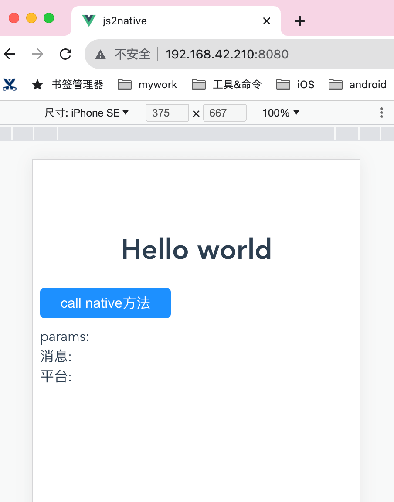
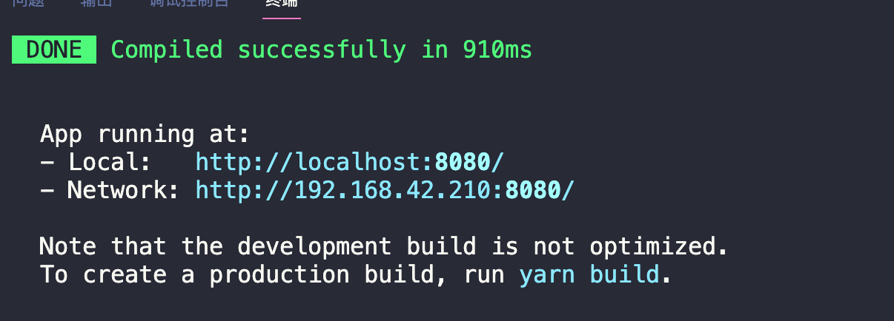
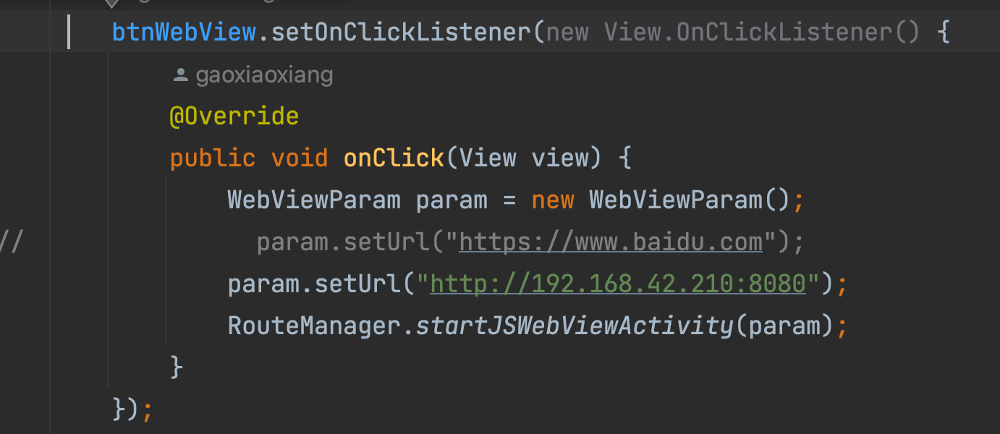

# js2native

## Project setup
```
yarn install
```

### Compiles and hot-reloads for development
```
yarn serve
```

### Compiles and minifies for production
```
yarn build
```

### Lints and fixes files
```
yarn lint
```

### Customize configuration
See [Configuration Reference](https://cli.vuejs.org/config/).


### js通过jsbridge与原生交互
1. 本地服务
   

2. yarn serve运行本地服务
   

3. 在xxshop-andriod项目的MainActivity中

设置Url为本地服务的url

4. android中效果
   - 调用原生方法：callNative
   - 调用JS方法：右上角帮助
